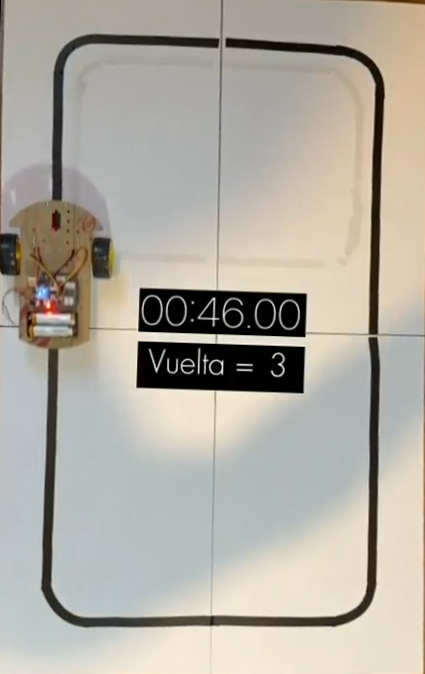

# 🚗 Carrito Seguidor de Línea

Este proyecto consiste en un **carrito autónomo con Arduino** que sigue una línea marcada en el suelo mediante sensores infrarrojos.  
Es un ejemplo práctico de control automático aplicado a robótica móvil.

---

## 🔧 Tecnologías y componentes usados
- Arduino UNO  
- Módulo Driver L298N  
- Motores DC con llantas  
- Sensores infrarrojos (IR)  
- Protoboard y cables  
- Fuente de energía (batería)  

---

## 📂 Archivos incluidos
- `Line_Tracking_2WD_Smart_Car.ino` → Código Arduino principal.  
- Carpeta `/Fotos/` → Imágenes del prototipo.  
- `Diseño final Carrito.png` → Vista general del diseño.  

---

## 📸 Imágenes del proyecto
### Vista general

### Vista superior

### Vista inferior

### Pista de prueba

---

## 🚀 Funcionamiento
1. Los sensores infrarrojos detectan la línea negra sobre un fondo blanco.  
2. Según la señal de los sensores, el Arduino controla los motores a través del driver L298N.  
3. El carrito corrige su trayectoria para mantenerse siempre sobre la línea.  

---

## 👤 Autor
**Oscar Alejandro Nájera Villa**  
📧 oscaralejandronajeravilla@gmail.com  
🔗 [LinkedIn](https://www.linkedin.com/in/oscar-alejandro-najera-villa-79756b34a)
